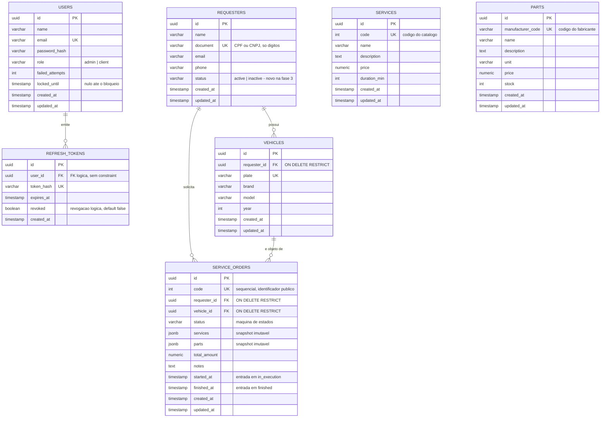
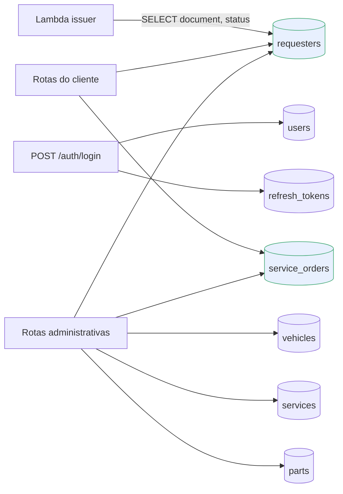

# Modelagem de dados

Tech Challenge Fase 3 — FIAP Pós Tech SOAT · Grupo 112

Documento exigido pelo enunciado: justificativa formal da escolha do banco, ajustes no modelo relacional e explicação dos relacionamentos.

O diagrama ER está desenhado abaixo em Mermaid, renderizado direto no GitHub. A mesma modelagem em DBML está em [`database-model.dbml`](./database-model.dbml), para abrir em <https://dbdiagram.io/d>.

---

## Diagrama ER



`SERVICES` e `PARTS` aparecem sem linha de relacionamento **de propósito**: elas são catálogos, e a OS guarda uma *cópia* dos itens em `jsonb`, não uma chave estrangeira. O porquê está na seção 4.

### Onde cada tabela é tocada



A Lambda de autenticação toca **uma única tabela** e apenas para leitura. É a menor superfície possível para a função mais exposta do sistema.

---

## 1. Justificativa da escolha do banco

### Por que relacional

O domínio da oficina é fortemente relacional e transacional:

- Uma **ordem de serviço** só existe amarrada a um **solicitante** e a um **veículo**, e esse veículo tem que pertencer àquele solicitante. É uma invariante de integridade referencial, não uma regra de conveniência.
- O ciclo de vida da OS é uma **máquina de estados** com transições válidas fixas (`received → in_diagnosis → awaiting_approval → in_execution → finished → delivered`). Transição inválida precisa falhar de forma atômica.
- Relatórios da fase — volume diário de OS e tempo médio por status — são agregações por data e por estado. É exatamente o que SQL faz melhor.
- O volume é baixo e o schema é estável. Não há nada aqui que justifique o custo operacional de um banco não relacional.

Um banco de documentos exigiria duplicar solicitante e veículo dentro de cada OS, ou emular joins na aplicação. Perderíamos a garantia de unicidade de CPF/CNPJ e de placa, que hoje é imposta pelo próprio banco.

### Por que PostgreSQL

| Critério | Peso na decisão |
|---|---|
| **Continuidade** | Fases 1 e 2 já rodavam PostgreSQL 16. Migrar de engine agora gastaria o prazo sem ganho de nota. |
| **`jsonb` nativo** | Os itens de serviço e de peça da OS são gravados como *snapshot* imutável em `jsonb`. Isso preserva o preço praticado no momento da abertura mesmo que a tabela `parts` mude depois — sem uma tabela de histórico e sem sair do relacional. |
| **`gen_random_uuid()` nativo** | Chaves primárias UUID geradas pelo banco, sem extensão adicional a partir do PG 13. |
| **Suporte gerenciado** | Disponível como serviço gerenciado nas três nuvens principais, o que mantém a decisão de nuvem reversível. |
| **Custo** | `db.t3.micro` Single-AZ é a instância mais barata que atende, e entra no free tier de contas novas. |

### Por que gerenciado (Amazon RDS)

O enunciado exige banco gerenciado. Além disso, o RDS entrega sem código o que teríamos que construir e operar: backup automático com retenção configurável, criptografia em repouso, *Performance Insights* para as métricas de banco que alimentam a observabilidade da fase, e `Multi-AZ` acionável por uma flag quando o ambiente é produção.

O provisionamento vive em [`postech-tc3-infra-database`](https://github.com/Kc1t/postech-tc3-infra-database), em repositório separado com pipeline próprio, como o enunciado pede.

### Alternativas avaliadas e descartadas

| Alternativa | Por que não |
|---|---|
| **MySQL / Aurora MySQL** | Sem ganho sobre PostgreSQL para este domínio, e custaria a reescrita das migrations e dos testes de repositório. |
| **DynamoDB** | Modelagem por padrão de acesso quebraria as agregações por data e status exigidas nos dashboards, e não impõe as unicidades de que dependemos. |
| **Aurora Serverless v2** | Escala melhor, mas o piso de custo por ACU é maior que o de uma `db.t3.micro` parada, e o projeto tem tráfego de demonstração. |
| **PostgreSQL em contêiner no cluster** | Descumpre o requisito de banco gerenciado e jogaria backup, HA e patching para cima do time. |

---

## 2. Ajustes no modelo relacional para a Fase 3

### 2.1 Nova coluna `requesters.status`

**O que mudou:** `requesters` ganhou `status varchar not null default 'active'`, com domínio `active | inactive`.

**Por que:** o enunciado exige que a function serverless de autenticação *"consulte a existência **e o status** do cliente na base de dados"*. O modelo herdado das Fases 1 e 2 só permitia responder à existência — não havia nenhuma coluna que expressasse se o cliente está apto a se autenticar. Sem ela, o requisito é impossível de cumprir.

**Como foi implementado:**

- `entities.RequesterStatus` como tipo próprio com `IsValid()`, em vez de `bool`. Um booleano `active` fecharia a porta para estados futuros (`suspended`, `blocked`) exigindo nova migration e quebra de contrato; um `varchar` validado no domínio absorve isso sem alterar o schema.
- `SetStatus` **não** toca `updated_at`, seguindo o mesmo contrato de `SetID`: é um setter de reconstituição, usado pelo repositório ao materializar a entidade vinda do banco. Os setters de mutação de negócio (`SetName`, `SetEmail`, `SetPhone`) continuam tocando.
- O `default 'active'` no nível do banco garante que as linhas já existentes continuem autenticando após o `AutoMigrate`, sem backfill manual.
- `ToDomain` trata coluna vazia como `active`, defendendo contra linhas inseridas fora do fluxo da aplicação.

**Consumo:** a Lambda de autenticação lê `document` e `status` de `requesters` e responde `403` quando o solicitante existe mas não está ativo, distinguindo esse caso do `404` de inexistente.

### 2.2 Correção da documentação do schema

O `database-model.dbml` estava defasado em relação ao código e foi regravado a partir dos modelos GORM. Divergências corrigidas:

| Documentado antes | Real |
|---|---|
| tabela `customers` | tabela `requesters` |
| `vehicles.customer_id` | `vehicles.requester_id` |
| `service_orders.customer_id` | `service_orders.requester_id` |
| status `in_progress`, `completed`, `cancelled` | `in_execution`, `finished`, e não existe `cancelled` |
| — | faltavam `service_orders.code`, `started_at` e `finished_at` |
| — | faltavam os únicos `services.code` e `parts.manufacturer_code` |

Isso não é cosmético: `started_at` e `finished_at` são a base do dashboard de **tempo médio de execução por status** exigido na fase. Documentá-las é o que torna aquela métrica auditável.

---

## 3. Relacionamentos

```
users 1 ──< N refresh_tokens

requesters 1 ──< N vehicles
requesters 1 ──< N service_orders
vehicles   1 ──< N service_orders
```

| Relação | Cardinalidade | Regra |
|---|---|---|
| `users` → `refresh_tokens` | 1:N | Cada login emite um refresh token com hash único. Revogação é lógica, via flag `revoked`, para preservar a trilha de auditoria. A chave é **lógica**: o model não declara associação, então o `AutoMigrate` cria só o índice em `user_id`, sem constraint física — a integridade fica com o use case de login. |
| `requesters` → `vehicles` | 1:N | `ON DELETE RESTRICT`. Um solicitante com veículo cadastrado não pode ser apagado — apagar deixaria OS órfãs e destruiria o histórico da oficina. |
| `requesters` → `service_orders` | 1:N | `ON DELETE RESTRICT`, pelo mesmo motivo. A OS é registro histórico e financeiro. |
| `vehicles` → `service_orders` | 1:N | `ON DELETE RESTRICT`. O veículo é o objeto do serviço; sem ele a OS perde sentido. |

**Nota de implementação:** o tag `constraint:OnDelete:RESTRICT` está no campo de ID (`model/vehicle.go`, `model/serviceorder.go`), mas o GORM lê restrições no campo da associação. A FK pode, então, ter nascido com o padrão do PostgreSQL, `NO ACTION`, que também recusa o `DELETE` de um registro com filhos — a diferença para `RESTRICT` é só o momento da checagem. Mover o tag para a associação não alteraria um schema já migrado, porque o `AutoMigrate` não mexe em constraints existentes.

**Por que `RESTRICT` e não `CASCADE`:** em oficina, ordem de serviço é documento fiscal e histórico de manutenção do veículo. Cascatear a exclusão apagaria silenciosamente esse histórico a partir de um `DELETE /requesters/:id`. A exclusão de solicitante com vínculo deve falhar de forma explícita e ser tratada como desativação — que é justamente o papel do `status` introduzido em 2.1.

**Índices além das PKs:**

| Índice | Motivo |
|---|---|
| `requesters.document` (único) | Impede CPF/CNPJ duplicado e é o caminho de busca da Lambda de autenticação. |
| `vehicles.plate` (único) | Placa é identificador natural do veículo. |
| `vehicles.requester_id` | Suporta `GET /requesters/:id/vehicles`. |
| `service_orders.code` (único, sequencial) | Código público da OS, usado nas rotas de consulta e aprovação sem expor UUID. |
| `service_orders.requester_id` | Suporta a listagem de OS por solicitante. |
| `refresh_tokens.token_hash` (único) | Lookup na renovação de sessão. |
| `refresh_tokens.user_id` | Revogação de todas as sessões de um usuário. |
| `services.code` (único) | Código do serviço no catálogo da oficina. |
| `parts.manufacturer_code` (único) | Código do fabricante; impede a mesma peça cadastrada duas vezes. |

---

## 4. Snapshot em `jsonb`

`service_orders.services` e `service_orders.parts` guardam **cópia** de descrição, preço e quantidade no momento da abertura, e não referências vivas às tabelas `services` e `parts`.

É uma desnormalização deliberada. Se a oficina reajustar o preço de uma peça, o valor de uma OS já fechada não pode mudar retroativamente — o total precisa continuar batendo com o que foi cobrado do cliente. A alternativa normalizada seria uma tabela de versões de preço com validade temporal, mais correta na teoria e desproporcional para o volume deste sistema.

O `service_id` e o `part_id` continuam guardados dentro do snapshot, então a rastreabilidade até o catálogo atual é preservada.

---

## 5. Estratégia de migration

O schema é aplicado por `AutoMigrate` do GORM no bootstrap da aplicação (`cmd/api/bootstrap/container.go`), a partir dos modelos em `internal/adapters/outbound/postgresql/model`.

`AutoMigrate` cria tabelas, colunas e índices ausentes, mas **não** remove nem altera colunas existentes. A adição de `requesters.status` é compatível com esse comportamento: a coluna entra com `not null default 'active'`, e as linhas preexistentes assumem o default sem intervenção.

**Limite conhecido:** mudanças destrutivas (renomear ou remover coluna, alterar tipo) não são cobertas por `AutoMigrate` e exigiriam ferramenta de migration versionada, como `golang-migrate`. Nenhuma mudança dessa natureza foi necessária nesta fase; se vier a ser, a troca de ferramenta deve virar ADR própria.
