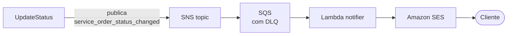

# ADR-0011: Notificações por SMTP dentro da aplicação, com caminho para serverless

- **Status:** Accepted
- **Data:** 2026-09
- **Decisão por:** Reservoir Devs

## Contexto

O desafio da Fase 3 fala em adotar soluções serverless "para autenticação e notificações". A autenticação virou Lambda ([ADR-0007](./0007-api-gateway-comunicacao.md), [ADR-0009](./0009-lambda-terraform-em-vez-de-sam.md)). Os requisitos obrigatórios da fase pedem function serverless para autenticação, mas não trazem um requisito equivalente para notificação.

A notificação herdada da Fase 2 é o adapter `internal/adapters/outbound/smtp/email_notifier.go`, que implementa a porta `ports.EmailNotifier` (`internal/ports/notifiers.go`) e envia o e-mail pelo relay SMTP da Brevo. Os use cases `UpdateStatus` e `UpdateStatusByCode` chamam `NotifyStatusChange` de forma síncrona, **depois** de gravar a nova situação da OS.

Levar a notificação para fora do pod exige um tópico ou fila (SNS/SQS), uma segunda Lambda e um provedor de e-mail. No Learner Lab, o SES de uma conta nova começa em sandbox e só entrega para endereços verificados, e toda role precisa ser a `LabRole`. O prazo da fase foi para os requisitos obrigatórios.

## Decisão

**Manter o envio por SMTP dentro da aplicação nesta fase**, atrás da porta `ports.EmailNotifier`, e registrar o desenho serverless como evolução.

O que já está garantido no desenho atual:

- **A falha de envio não desfaz a mudança de status.** O status é gravado antes; o erro do SMTP vira log.
- **A falha é observável.** Cada erro gera o evento `integration_failure`, com `integration=smtp` e `stage` (`requester_lookup` ou `send`). Esse evento alimenta o widget "Erros e falhas nas integrações" do dashboard e o alerta "Falha de integração" do New Relic.
- **O envio pode ser desligado.** Com `SMTP_HOST` vazio, o adapter vira no-op.

### Desenho alvo

A mudança fica contida em um adapter novo: um `sns.EmailNotifier` que implementa a mesma porta e publica o evento, no lugar do adapter SMTP. Os use cases não mudam — é o ganho da arquitetura hexagonal ([ADR-0002](./0002-hexagonal-architecture.md)). A Lambda consumidora viveria em um repositório próprio ou no `postech-tc3-lambda-auth`, com Terraform e pipeline como as outras functions.

## Alternativas consideradas

1. **SNS → SQS → Lambda → SES agora.** É o desenho correto, e é o alvo. Adiado pelo prazo e pelo sandbox do SES, que impediria demonstrar a entrega a um cliente de verdade.
2. **Lambda chamada direto pela aplicação (invoke síncrono).** Tiraria o SMTP do pod, mas manteria o acoplamento temporal — a requisição continuaria esperando o envio — e trocaria um problema por outro.
3. **Fila no próprio cluster (goroutine + retry em memória).** Resolveria a latência, mas perderia mensagens a cada restart de pod, e o HPA reinicia pods com frequência.

## Consequências

### Positivas

- Nenhuma infraestrutura nova, nenhum custo novo e nenhuma role IAM a mais.
- A falha de envio aparece no dashboard e dispara alerta.
- A troca para serverless é localizada: um adapter, uma function e o Terraform dela.

### Negativas

- **O envio é síncrono.** A latência do SMTP soma na latência da mudança de status.
- **Não há retry.** Um e-mail que falha não é reenviado; só fica registrado.
- **O desafio não é atendido ao pé da letra.** A parte "serverless para notificações" é dívida registrada, não entregue.

## Referências

- Porta: [`internal/ports/notifiers.go`](../../internal/ports/notifiers.go)
- Adapter: [`internal/adapters/outbound/smtp/email_notifier.go`](../../internal/adapters/outbound/smtp/email_notifier.go)
- Observabilidade: [`docs/newrelic/`](../newrelic/)
- Amazon SES — [Moving out of the sandbox](https://docs.aws.amazon.com/ses/latest/dg/request-production-access.html)
