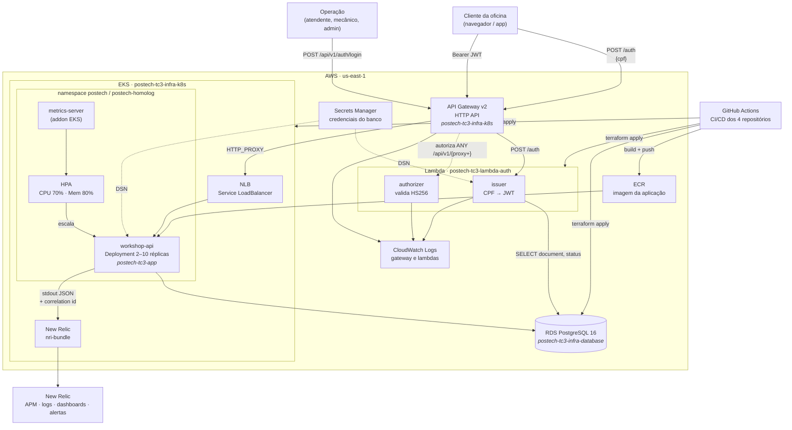

# Diagrama de Componentes

Visão de nuvem da solução: APIs, banco e monitoramento.

## Camadas de autenticação

| Rota no gateway | Autorização no gateway | Validação na aplicação |
|---|---|---|
| `POST /auth` | aberta | — |
| `POST /api/v1/auth/{proxy+}` | aberta | — |
| `GET /{proxy+}` | aberta | — |
| `ANY /api/v1/{proxy+}` | authorizer Lambda | middleware `Auth` |

As duas camadas validam o mesmo JWT HS256 com o mesmo segredo. Justificativa em [ADR-0007](../adr/0007-api-gateway-comunicacao.md).

## Fronteiras de repositório

| Repositório | Provisiona |
|---|---|
| `postech-tc3-infra-database` | RDS, subnet group, security group, secret |
| `postech-tc3-infra-k8s` | EKS, node group, metrics-server, API Gateway, rotas, authorizer, agente New Relic |
| `postech-tc3-lambda-auth` | Duas Lambdas, security group, log groups |
| `postech-tc3-app` | Imagem no ECR e manifests aplicados no cluster |
