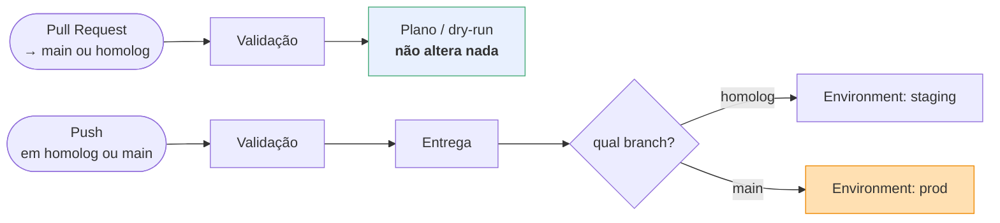
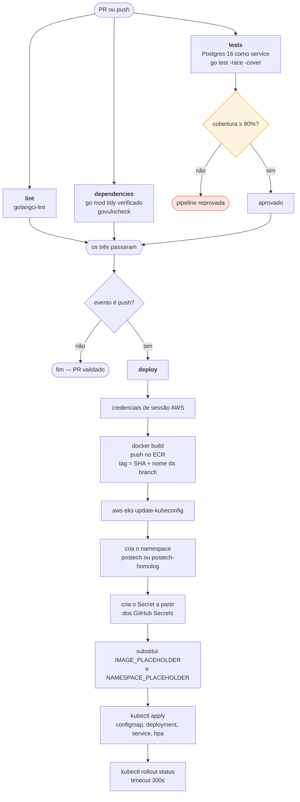
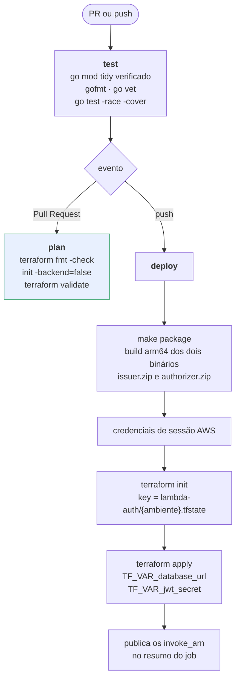
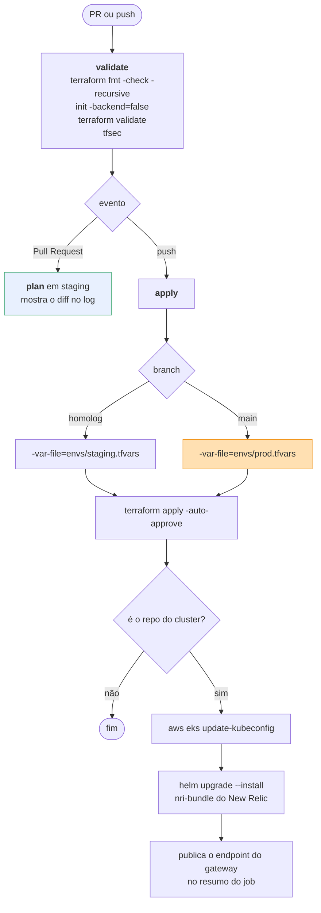
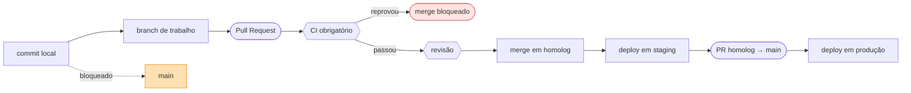

# Pipelines de CI/CD

Quatro repositórios, quatro pipelines independentes. Todos autenticam na AWS com credencial de sessão do Learner Lab e disparam nos mesmos eventos: Pull Request valida, push entrega.

---

## 1. Modelo comum



A separação é rígida: **nenhum job que roda em Pull Request tem permissão de escrita na nuvem**. O `plan` do Terraform e o `validate` são leitura; o `apply` só existe no gatilho de push.

---

## 2. `postech-tc3-app` — aplicação



A cota entra **antes** do Deployment: o `LimitRange` só vale para pods criados depois dele, e aplicá-lo na ordem inversa deixaria o primeiro rollout fora do teto.

O gate de cobertura filtra mocks, `cmd/api`, `docs`, `scripts`, `pkg/env` e `pkg/ioc` antes de calcular — código gerado e ponto de entrada não inflam o número. A cobertura efetiva hoje é **82,4%**.

---

## 3. `postech-tc3-lambda-auth` — funções serverless



O Terraform é dono do código: o `source_code_hash` do zip dispara a atualização da função no `apply`. Não existe passo de `update-function-code` — decisão no [ADR-0009](../adr/0009-lambda-terraform-em-vez-de-sam.md).

O resumo do job imprime os quatro valores que o `infra-k8s` precisa, prontos para colar.

---

## 4. `postech-tc3-infra-k8s` e `postech-tc3-infra-database`

Os dois seguem a mesma forma.



O passo do New Relic é tolerante: sem `NEW_RELIC_LICENSE_KEY` configurada, ele registra que está pulando e o `apply` segue normalmente. Isso permite subir a infraestrutura antes de existir conta de observabilidade.

---

## 5. Secrets por repositório

```mermaid
flowchart LR
    lab(["AWS Academy<br/>Learner Lab"]) -->|"AWS Details → CLI: Show"| file["`.aws-lab-credentials`<br/>não versionado"]
    file --> script["scripts/sync-aws-secrets.sh"]
    script --> r1["app"]
    script --> r2["lambda-auth"]
    script --> r3["infra-k8s"]
    script --> r4["infra-database"]

    style lab fill:#fff4e0,stroke:#d90
```

| Secret | app | lambda-auth | infra-k8s | infra-database |
|---|:-:|:-:|:-:|:-:|
| `AWS_ACCESS_KEY_ID` | ✅ | ✅ | ✅ | ✅ |
| `AWS_SECRET_ACCESS_KEY` | ✅ | ✅ | ✅ | ✅ |
| `AWS_SESSION_TOKEN` | ✅ | ✅ | ✅ | ✅ |
| `AWS_REGION` | ✅ | ✅ | ✅ | ✅ |
| `TF_STATE_BUCKET` | — | ✅ | ✅ | ✅ |
| `EKS_CLUSTER_NAME` | ✅ | — | — | — |
| `POSTGRES_DSN` | ✅ | ✅ | — | — |
| `JWT_SECRET` | ✅ | ✅ | — | — |
| `NEW_RELIC_LICENSE_KEY` | ✅ | — | ✅ | — |
| `SMTP_USERNAME` / `SMTP_PASSWORD` | ✅ | — | — | — |
| `ADMIN_PASSWORD` | ✅ | — | — | — |

O `JWT_SECRET` aparece em dois repositórios e **precisa ser idêntico**. Se divergir, o token emitido pela Lambda é recusado com 401 pelo authorizer e pela aplicação. É o erro de configuração mais provável do projeto.

**As três credenciais da AWS expiram junto com a sessão do lab, a cada ~4 horas.** Rodar o script antes de qualquer deploy é parte do fluxo, não uma exceção.

---

## 6. Proteção de branch



> **Pendente.** A seta pontilhada — push direto na `main` bloqueado — ainda não está aplicada. Proteção de branch exige repositório público ou plano pago, e a decisão do grupo foi manter privado durante o desenvolvimento e tornar público antes da submissão. Enquanto isso, a disciplina de PR é acordo entre as pessoas, não trava técnica.
