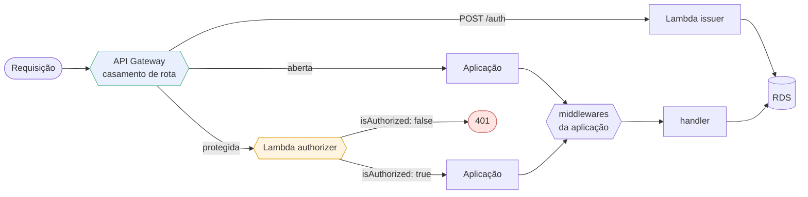
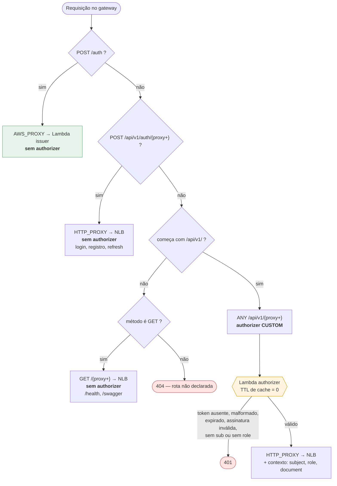
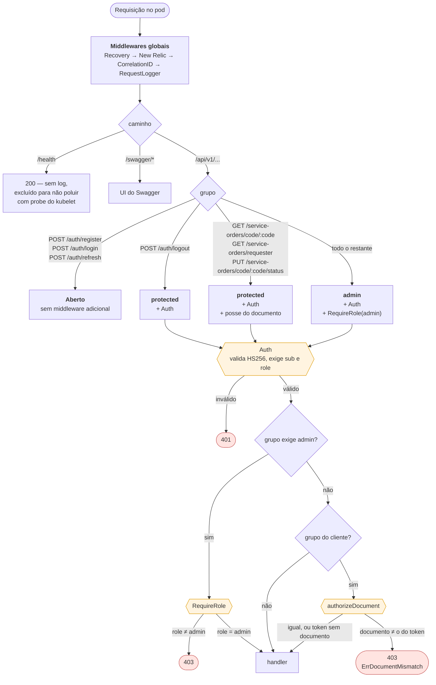
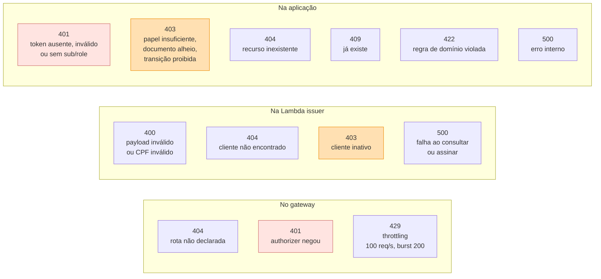
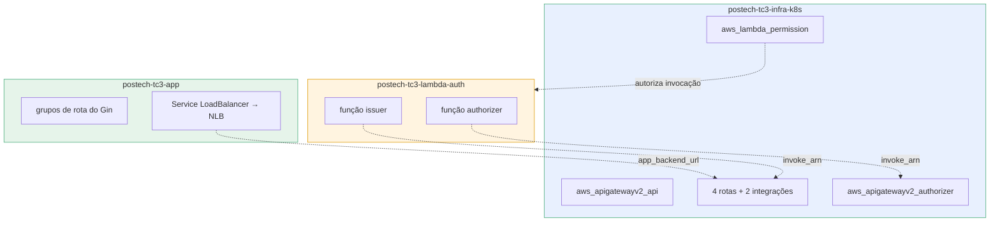

# Roteamento

Toda requisição atravessa duas malhas de decisão: primeiro o **API Gateway**, que escolhe o destino e decide se chama o authorizer; depois o **roteador da aplicação**, que escolhe o grupo de middlewares. Este documento desenha as duas.

---

## 1. Visão geral — o caminho de uma requisição

O ponto que costuma passar despercebido: **passar pelo authorizer não dispensa os middlewares da aplicação**. São duas decisões independentes sobre o mesmo token, e a segunda ainda checa papel e posse do documento. Justificativa em [ADR-0007](../adr/0007-api-gateway-comunicacao.md).

---

## 2. Roteamento no API Gateway

O API Gateway v2 resolve por **especificidade**: a rota mais específica vence, e `$default` é o último recurso. A ordem abaixo é a de avaliação efetiva.

### Tabela de rotas do gateway

| Ordem | Rota | Integração | Authorizer | Por quê |
|---|---|---|---|---|
| 1 | `POST /auth` | `AWS_PROXY` → issuer | não | É onde o CPF vira token; exigir token aqui seria circular |
| 2 | `POST /api/v1/auth/{proxy+}` | `HTTP_PROXY` → NLB | não | Login da operação por e-mail e senha — outro fluxo de identidade |
| 3 | `ANY /api/v1/{proxy+}` | `HTTP_PROXY` → NLB | **sim** | Todo o resto da API |
| 4 | `GET /{proxy+}` | `HTTP_PROXY` → NLB | não | `/health` para as probes e o Swagger |

**Por que a 2 precisa existir:** sem ela, `POST /api/v1/auth/login` cairia na regra 3 e exigiria um token para obter um token. A rota mais específica vence, e é isso que abre a exceção.

**Por que a 4 é só `GET`:** limita a superfície aberta. Um `POST` para um caminho não declarado devolve 404 no gateway, sem chegar na aplicação.

---

## 3. Roteamento na aplicação

O roteador do Gin monta quatro grupos, cada um com uma pilha de middlewares diferente.

### A checagem de posse

`authorizeDocument` compara o documento pedido com a claim `document` do token:

| Token | Documento pedido | Resultado |
|---|---|---|
| `document = 529…725` | `529…725` | passa |
| `document = 529…725` | `390…705` | **403** |
| sem claim `document` (token de operação) | qualquer | passa — a operação já tem acesso pelas rotas administrativas |

Sem ela, qualquer cliente autenticado leria as ordens de serviço de qualquer outro conhecendo apenas o CPF. Registrada na [RFC-0003](../rfc/0003-autenticacao-por-cpf.md).

---

## 4. Inventário completo — 37 rotas

Todas sob o prefixo `/api/v1`.

### Abertas (3)

| Método | Rota | Quem usa |
|---|---|---|
| `POST` | `/auth/register` | operação |
| `POST` | `/auth/login` | operação |
| `POST` | `/auth/refresh` | operação |

Fora do prefixo: `GET /health` e `GET /swagger/*any`.

### Autenticadas, qualquer papel (1)

| Método | Rota |
|---|---|
| `POST` | `/auth/logout` |

### Cliente — autenticado por CPF, com posse do documento (3)

| Método | Rota | Papel no fluxo |
|---|---|---|
| `GET` | `/service-orders/code/{code}` | consulta o orçamento |
| `GET` | `/service-orders/requester` | lista as próprias OS |
| `PUT` | `/service-orders/code/{code}/status` | aprova (`in_execution`) ou recusa (`received`) |

### Administrativas — exigem `role: admin` (30)

| Recurso | Rotas |
|---|---|
| **Solicitantes** | `POST /requesters` · `GET /requesters` · `GET /requesters/{id}` · `GET /requesters/document/{document}` · `PUT /requesters/{id}` · `DELETE /requesters/{id}` · `GET /requesters/{id}/vehicles` |
| **Veículos** | `POST /vehicles` · `GET /vehicles` · `GET /vehicles/{id}` · `PUT /vehicles/{id}` · `DELETE /vehicles/{id}` |
| **Serviços** | `POST /services` · `GET /services` · `GET /services/{id}` · `PUT /services/{id}` · `DELETE /services/{id}` |
| **Peças** | `POST /parts` · `GET /parts` · `GET /parts/{id}` · `PUT /parts/{id}` · `DELETE /parts/{id}` · `PATCH /parts/{id}/stock` |
| **Ordens de serviço** | `POST /service-orders` · `GET /service-orders` · `GET /service-orders/{id}` · `PUT /service-orders/{id}` · `PUT /service-orders/{id}/status` · `DELETE /service-orders/{id}` · `GET /service-orders/metrics/execution-time` |

---

## 5. Mapa de códigos de resposta

Onde cada código pode nascer, e quem o produz.

O mesmo código pode vir de camadas diferentes, e isso importa ao depurar. Um `401` do gateway **não aparece nos logs da aplicação** — a requisição nunca chega no pod. Se o log da aplicação está vazio para uma chamada que o cliente jura ter feito, o suspeito é o authorizer, e a evidência está no access log do gateway em CloudWatch.

---

## 6. Fronteira entre repositórios

Quem declara o quê:

As três ligações pontilhadas são **valores passados à mão** entre repositórios, não referências de Terraform — os states são separados. A ordem de aplicação é:

1. `infra-database` → RDS de pé.
2. `infra-k8s` → cluster e gateway sem rotas (as variáveis de Lambda e backend ficam vazias).
3. `lambda-auth` → publica as funções e imprime os `invoke_arn` no resumo do job.
4. `app` → deploy cria o NLB; `kubectl get svc workshop-api` dá o hostname.
5. `infra-k8s` de novo → agora com `lambda_issuer_invoke_arn`, `lambda_authorizer_invoke_arn` e `app_backend_url` preenchidos.

O passo 5 existe porque as variáveis são opcionais de propósito: sem elas o gateway sobe vazio, o que quebra a dependência circular entre gateway, Lambda e NLB.
