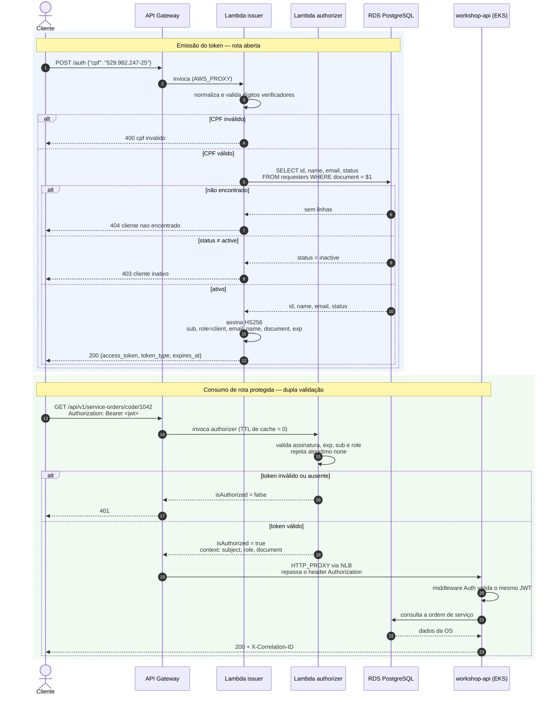

# Diagrama de Sequência — Autenticação por CPF

Fluxo completo: o cliente troca o CPF por um JWT e usa esse token em uma rota protegida.

## Pontos de decisão

| Ponto | Regra |
|---|---|
| Validação do CPF | Dígitos verificadores calculados localmente, antes de qualquer ida ao banco |
| Existência | `SELECT` por `document`, que tem índice único |
| Status | `status = 'active'`; qualquer outro valor resulta em 403 |
| Cache do authorizer | Zero — desativar um cliente tem efeito na requisição seguinte |
| Segunda validação | O middleware `Auth` da aplicação repete a verificação, cobrindo acesso direto ao NLB |

## Distinção entre 404 e 403

A resposta separa "não existe" de "existe mas está inativo". É informação útil para o cliente legítimo e, ao mesmo tempo, permite enumerar CPFs cadastrados. Mitigado por throttling no stage do gateway e registrado como risco aceito na [RFC-0003](../rfc/0003-autenticacao-por-cpf.md).
