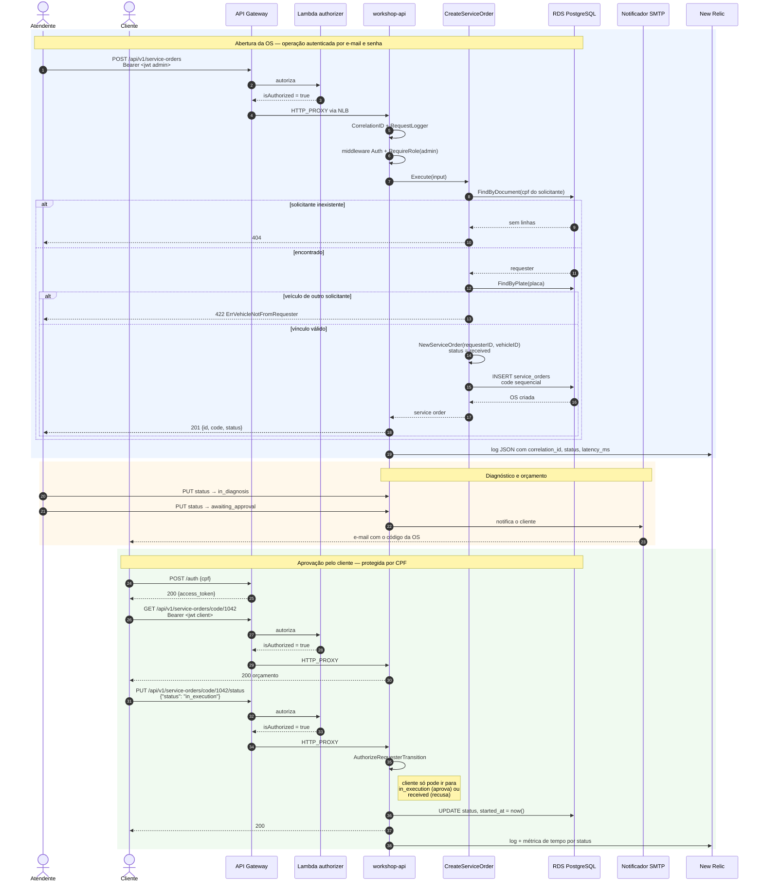
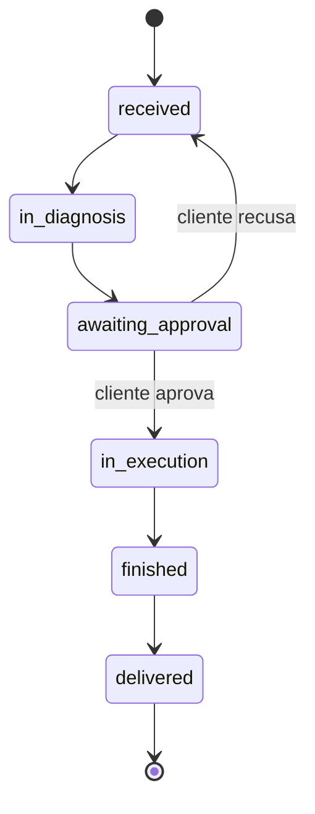

# Diagrama de Sequência — Abertura de Ordem de Serviço

Da abertura da OS pela operação até a aprovação do orçamento pelo cliente autenticado por CPF.

## Máquina de estados da OS

Transição fora deste grafo retorna `ErrInvalidStatus`. O cliente autenticado por CPF só pode iniciar as duas transições marcadas; as demais pertencem ao fluxo operacional da oficina.

## Origem das métricas dos dashboards

| Dashboard exigido | Fonte |
|---|---|
| Volume diário de ordens de serviço | `created_at` de `service_orders` |
| Tempo médio por status | `started_at` (entrada em `in_execution`) e `finished_at` (entrada em `finished`) |
| Erros e falhas nas integrações | Logs de nível `error` com `correlation_id`, incluindo falhas do notificador SMTP |
| Latência das APIs | `latency_ms` do `RequestLogger` e o access log do gateway |

As colunas `started_at` e `finished_at` são gravadas por `UpdateStatus` no momento exato da transição — é o que torna a métrica de tempo médio auditável contra o banco.
